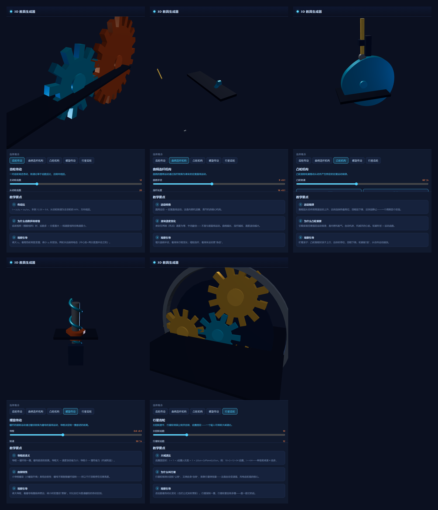

# 3D 教具生成器

输入机械/物理概念，自动生成可交互的 3D 教学教具。全程序化几何构建，零外部模型 / 图片 / 音频素材。

## 在线 Demo

> **在线体验**：https://teemaker-dev.github.io/teemaker-3d-teaching/

## 预览



## 这是什么

一个"概念 → 3D 教具"的生成工作台：左侧选择概念、调整参数，中间实时渲染可交互的 3D 机构，右侧同步显示教学要点。

内置 5 个机械原理教具：

| 教具 | 演示内容 |
|------|---------|
| 齿轮传动 | 传动比、转向相反、齿数-转速关系 |
| 曲柄连杆机构 | 圆周运动 ↔ 往复直线运动转换 |
| 凸轮机构 | 轮廓形状 = 运动函数，四个运动阶段 |
| 螺旋传动 | 导程、旋转 → 直线、自锁特性 |
| 行星齿轮 | 公转+自转、大减速比 |

## 技术栈

- React 19 + TypeScript
- Three.js + @react-three/fiber
- zustand（共享状态）
- Vite 5

## 快速开始

```bash
npm install
npm run dev        # 开发服务器 → http://localhost:5173
npm run build      # 类型检查 + 生产构建 → dist/
npm run preview    # 预览生产构建
```

## 项目结构

```
src/
  engine/       程序化几何工厂（GeometryFactory）、动画时钟、3D 画布
  templates/    5 个机构模板（几何构建 + 运动学 + 教学元数据）
  data/         概念注册表
  ui/           概念选择器 / 参数面板 / 教学要点卡 / 错误边界
  store.ts      zustand 状态（概念、参数、动画开关）
  App.tsx       三栏布局
```

## 设计要点

- **零素材**：齿轮（梯形齿近似）、凸轮（基圆+简谐升程）、丝杠（螺旋线 Tube）等全部程序化生成
- **参数化**：每个教具的参数滑块实时驱动几何与运动学
- **统一动画时钟**：暂停/继续由单一时钟控制，机构间时序一致
- **健壮性**：store 自动填充默认参数，ErrorBoundary 兜底渲染错误

## 许可

MIT © 2026 Zhou Jianyong。教学与学习用途自由使用、修改、分发。
